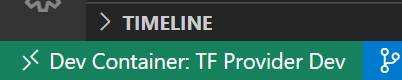

# VSCode Environment for Terraform Azure Provider Development

This Repo is to provide an isolated and low-configuration environment for Terraform Azure Providers. The goal is to get a developer adding provider features as quickly as possible.

VSCode Dev Container Includes:
* Go 1.16
* Terraform
* Az CLI
* Symlinked `.terraformrc`
* Use of `.env` file and a `setenv` command to set and update environment variables

## Getting Started

### 1. Repo Setup

1. Clone this repo in your local machine: `git clone git@github.com:howlowck/vscode-dev-container-tf-provider.git`. This will create a directory, we will call this directory the "environment" directory.
2. Inside the "environment" directory, clone your forked `terraform-provider-azurerm` repo.
3. Open the "environment" directory in VSCode Dev Container.
4. At this point, you should see  in the lower-left corner of your VSCode. Also you should have `terraform-provider-azurerm` directory along with `.devcontainer`, `.env.example`, `.terraformrc`, etc in Explorer pane.

### 2. Set up Environment Variables

1. Run `az login` in the VSCode Dev Container terminal
2. Create a Service Principal with the subscription you want to use. **Take note of the output.**
3. Copy `.env.example` and Paste/Rename the new file as `.env`
4. Fill out the `.env` file with info from Step 2. (You can leave `ARM_METADATA_HOST` blank.)
5. Run `setenv`
6. Run `env` to verify that the values are correctly set in the environment variables

### 3. Develop Provider Features (According to Provider README)

1. cd `terraform-provider-azurerm`
2. `make build`
3. You can now code the features. (If you are using ssh to auth, you might have to code in another VSCode instance outside of the container.)
4. To run acceptance test, for example: `go test -timeout 30m -run ^TestAccSignalRService_serviceMode$ github.com/terraform-providers/terraform-provider-azurerm/azurerm/internal/services/signalr -v`
